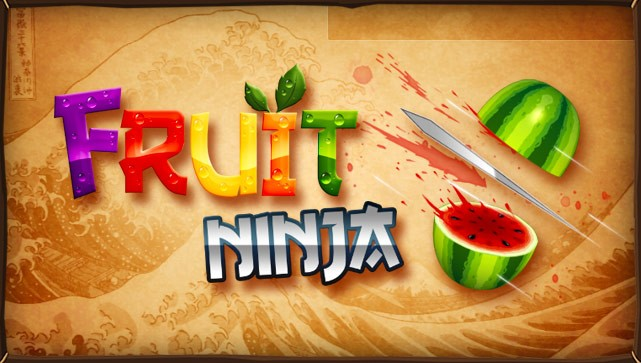
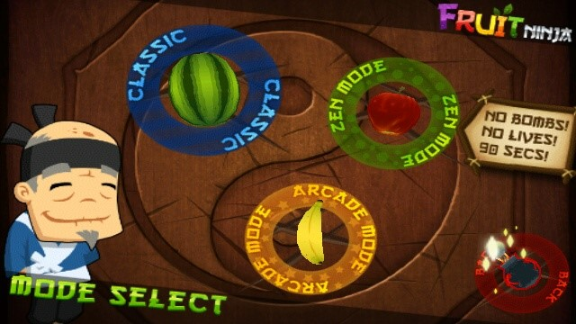

REVIEW : FRUIT NINJA

 
 
Fruit Ninja adalah permainan yang sangat sederhana, yang didasarkan dalam dua kata yaitu: chop (potong) dan fruit (buah). Dengan latar belakang kayu, berbagai jenis buah (dan bom sesekali) dilempar ke udara. Yang harus dilakukan adalah menggeser jari di atas layar untuk memotong buah menjadi dua sebelum hilang dari pandangan atau jatuh ke bawah. Bagian dari daya tarik Fruit Ninja adalah bahwa ini adalah ide yang sederhana, dan ketika pemain kalah dalam permainan, maka akan muncul dalam diri pemain untuk bermain kembali demi mendapatkan nilai yang lebih tinggi.

Game Play

Fruit Ninja memiliki 3 mode permainan :

Classic

Pemain hanya boleh melewatkan tiga buah saja barulah permainan berakhir, tapi hati-hati, jika pemain memotong sebuah bom tunggal (dilemparkan secara acak) maka permainan langsung berakhir. Jadi pemain harus menjaga mata mereka agar tetap fokus. Jika pemain berhenti memperhatikan layar bahkan sedetik pun, maka akan kehilangan peluang mencetak nilai besar, dan bahkan mungkin saja permainan berakhir.

Semakin banyak buah yang terpotong, maka semakin lama pemain bertahan. Semakin lama pemain bertahan, maka semakin tinggi nilai yang diperoleh. Ini adalah game sederhana yang diuntungkan dari kesederhanaannya. Jika seseorang mencoba memainkannya selama 10 detik, pasti dia akan mengatakan bahwa permainan ini menyenangkan dan merasa ingin memainkannya terus menerus.

Zen Mode

Pada Zen Mode, pemain akan diberikan waktu 1 menit 30 detik untuk memotong buah yang keluar. Pada mode ini tidak ada bom dan tidak ada nyawa. Jika pemain membiarkan buah terjatuh tanpa memotongnya, maka permainan tetap berlanjut hanya saja pemain meninggalkan poin yang seharusnya dapat diambil. Semakin banyak pemain dapat memotong buah, maka semakin banyak poin yang akan didapat.

Arcade Mode

Dalam Arcade Mode, pemain akan memiliki waktu 60 detik untuk berlomba mendapatkan poin tertinggi dari potongan buah. Jika bom terpotong maka akan mengurangi poin yang sudah dicapai oleh pemain. Akan ada juga pisang berwarna khusus yang keluar secara acak untuk memberi bonus kepada pemain jika pemain dapat memotongnya. Bonusnya seperti menggandakan poin pemain pada sementara waktu, memperlambat waktu, atau mengisi layar dengan deru buah. 
Gameplay Fruit Ninja ini dikupas dasar sehingga tidak mengherankan bahwa setiap update yang mereka lakukan hanya menambahkan elemen gameplay minor. Berbicara mengenai mode permainan, terdapat juga sistem penghargaan atau prestasi. Saat bermain dengan baik, tujuan spesifik, seperti potongan 100 pisang, maka akan pemain akan diberi penghargaan berupa modifikasi pada pola menyapu pisau, atau akan mendapatkan latar belakang yang berbeda.

Graphics

Tampilan game ini benar-benar terasa alami, terutama dengan perangkat yang memiliki layar besar. Grafisnya cukup sederhana sehingga permainannya berjalan mulus. Fruit Ninja memiliki grafis 3D yang menakjubkan sehingga kita bisa melihat buah dengan detail. Semuanya tajam dan terlihat bagus: bom, buah, bahkan apel di logo OpenFeint. Saat pemian memotong buah dan buahnya terbuka, maka akan melihat bagian dalam buah secara rinci, seperti jika kita mengiris semangka yang terbuka, akan melihat semua benihnya. Kontrolnya sederhana dan mudah tanpa ada kesalahan.

Sound

Permainan sederhana ini dikemas dengan sangat baik. Ketika buah dilempar, akan terdengar suara seperti ketapel yang menembakan pelurunya. Sedangkan bom mengeluarkan desisan, cukup untuk memberi peringatan agar  pemain tidak memotongnya. Setiap jenis buah mengeluarkan suara yang berbeda saat dipotong. Begitu juga pada bom, berbeda.

Jika kalian telah dipaksa diberi makan buah sejak kecil dan tidak menyukainya, maka akan berbeda ketika mendapat paksaan untuk bermain Fruit Ninja. Permainan ini menyenangkan dengan memotong buah yang tiada henti. Mudah untuk dimainkan, dan entah bagaimana game sederhana ini berhasil menghibur untuk waktu yang cukup lama serta membuatnya ingin dimainkan terus-menerus.
